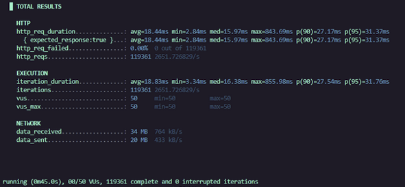
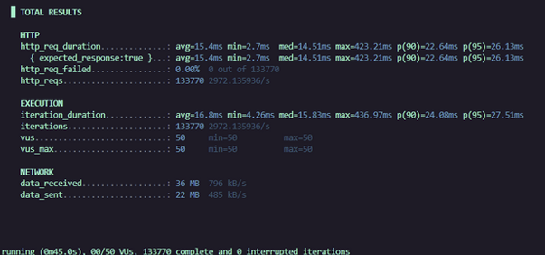

# Tiny Maps 

Tiny Maps is a small replica of existing maps applications with an emphasis on application load intensity. 

This project was able to handle a load of __over 100,000+ requests per second (rps), with 99.95% of the requests responding under 30 ms fkr the convert endpoint.__

# Technology Requirements

- Docker Desktop
- Docker & Docker-Compose
- Make 

# Disclaimers:

- You will need to have the following technologies installed above with respect to your own operating system (note: __some of the technologies used here are already provided via docker-compose file__)
- Due to GitHub's size limit of 100 MBs, map data is __NOT__ provided 
    - Create a folder called __map-data__ 
    - Follow the link below to download the .osm.pbf file of your choosing 
    - Place file in the folder 

```
https://download.geofabrik.de/
```

# Running Program with Docker 

```
docker-compose --profile db_load up
```

Note: This part will take some time, as it is uploading the .osm.pbf file into a PostgreSQL database.
In addition, please be sure to take a look at the __docker-compose.yml__ file and replace the placeholder path 
__with the absolute path__ to your .osm.pbf file.   

```
docker-compose up -d 
```

You can then visit 

```
http://localhost:5173/
```

# Running Program with Make 

```
make load-db
```

You can also run it through this way. Be mindful of the same set of instructions for this command above. 

```
make dir 
```

You can then also visit 

```
http://localhost:5173/
```

# Architecture


# Endpoint Testing (No Cache)



# Endpoint Testing (With Cache)




